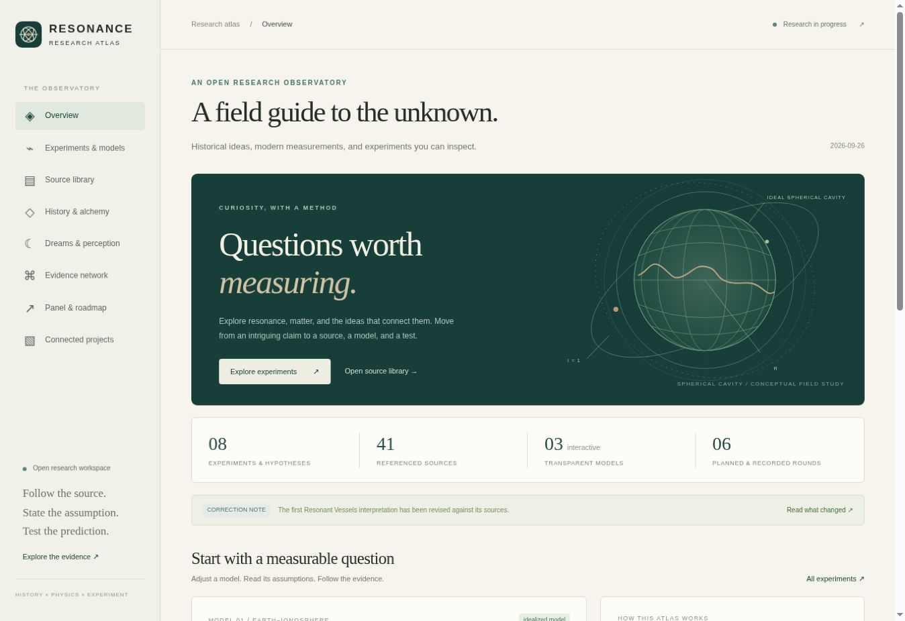

# Verified integrated release — 26 September 2026

The combined deployment is live.

- [Research atlas](https://occult-kranti.github.io/brainwave_opensync/research/)
- [Sixth session: Dreams & perception](https://occult-kranti.github.io/brainwave_opensync/research/#dreams)
- [Main application: connected projects](https://occult-kranti.github.io/brainwave_opensync/projects/)
- [Preserved original Open Sync suite](https://occult-kranti.github.io/brainwave_opensync/open-sync/)
- [Corrected Resonant Vessels exhibit](https://occult-kranti.github.io/brainwave_opensync/research/projects/resonant-vessels/research-corrections.html)

## Revisions and deployment evidence

Integrated source: `756091e18b69514849ce9154bf134bcb82fc5ea6`. GitHub Pages artifact branch: `4cca49a2d364145ef0ba0dacd06d371e1907fe47`. Corrected Resonant Vessels source: `d404a4e3d3df7dae6f947271510831139cf1be10`. Astrology import: `3a3ce9953e47a078e659723a52187648f1f08486`. Original audio suite: `02425613cd057406d92c4f3ee33b5fc54a493601`. Preserved legacy release: `2d1935714335cbb94c8f01ade62ed9e74ead1faf`.

All three GitHub runs completed successfully:

- [CI](https://github.com/occult-kranti/brainwave_opensync/actions/runs/36278141222)
- [Combined build and publication](https://github.com/occult-kranti/brainwave_opensync/actions/runs/36278141163)
- [GitHub Pages deployment](https://github.com/occult-kranti/brainwave_opensync/actions/runs/36278368887)

The live `build-manifest.json` and parent `deployments.json` returned the revisions above. The remote source tree was checked against the complete local Git tree before publication.

## Checks performed

The current audio application passed lint, typechecking, 1,145 tests and production build. The imported suite passed 730 tests and production build. The atlas passed seven independent numerical/data gates and seven DOM behavior gates; all six reviewed model bundles and 16 compressed CSV archives passed integrity checks. The local full assembly contained 128 HTML pages, with 75 linked research artifacts/project targets present. These counts do not imply that all imported scientific claims were reread or every page visually inspected.

Live browser checks verified the overview/source load, the dream journal and method page, the four-choice calculator (16 hits in 40 trials displays 0.02624), all five connected-project cards, the loaded concept illustration, the corrected imported archive, the preserved audio suite and its return path to the main application's Connected projects page. No audio exposure, human study or personal dream data was used during browser verification.

## Standalone baseline published

After the user completed sign-in, the standalone repository was created and GitHub Pages was configured with Actions. Baseline commit `c3aa2c695478aadca9a8a1b0f63e86405a3c6c55` deployed successfully in [run 36279210133](https://github.com/occult-kranti/resonance-research-atlas/actions/runs/36279210133). Browser inspection verified the fully loaded six-round atlas at https://occult-kranti.github.io/resonance-research-atlas/ .

The nanoparticle extension has a separate release record; the checks and revisions above describe the original integrated release, not its later changes.
