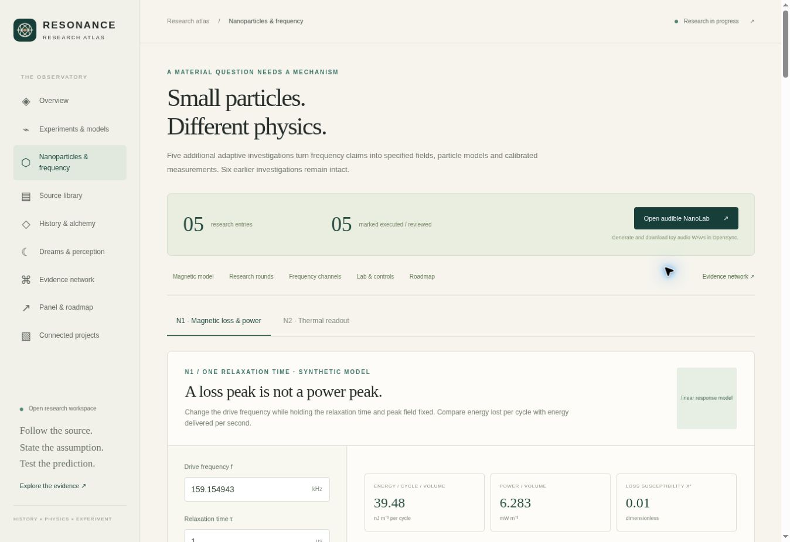

# Nanoparticle extension — verification record

The program contains five additional adaptive rounds, each accepted by the advisor model agent after source, implementation and output review. The original six rounds and their frozen results are unchanged. Historical people are methodological lenses; this is not human peer review.

## Release content

- 79 source records with reading depth and claim limits, including 38 new records from the two source lanes.
- Five numerical/audio bundles, with 30 parameterized production checks, raw data, scientific SVG/PNG plots, frozen contracts and independent reviews.
- Four actual OpenSync production WAVs and export manifests, exact renderer snapshots and byte-for-byte regeneration.
- Two new interactive equation explorers, six historical measurement plates, two apparatus-logic SVGs and a generated three-dimensional concept illustration.
- A dedicated nanoparticle source/experiment graph and parallel roadmap, with later physical work explicitly marked as proposed.
- OpenSync NanoLab: four bounded audio conditions, FFT and waveform views, shared playback ownership, WAV export and SHA-256 manifests.

## Checks

The final primary-app `npm run check` passed lint, TypeScript, 1,156 tests across 85 files and the Vite/PWA build. Eleven focused NanoLab tests include direct Fourier comparisons, decoded WAV checks, checksum identity, mode boundaries and playback/export lifecycle controls. Independent scientific review found two audio edge cases; both were repaired before this final gate.

The atlas has 10 nanoparticle numerical/DOM gates and 14 existing gates. Its five-round integrity verifier binds 103 model and review artifact files and 13 frozen production input files. The original six-round verifier retains 72 production checks and its existing independent-review bindings. Verification of a declared model does not establish a specimen response, clinical effect, new force or new law.

Source and output hashes, independent review records and reproduction commands are stored with the research. The individual solvers and advisor replays ran, and the four WAV/manifest pairs regenerated byte-for-byte. The combined verifier's optional `--recompute` mode was not run.

## Published release — 27 September 2026

Both GitHub Pages sites are live. The standalone atlas deployed source `36e3dcbe76be4a396c0fdbf94665b7ec4f915f97` in [successful run 36281001436](https://github.com/occult-kranti/resonance-research-atlas/actions/runs/36281001436). OpenSync deployed source `5bc616344881eaa9a5418304b535f8f8b3426170`; [CI](https://github.com/occult-kranti/brainwave_opensync/actions/runs/36281004565), [combined publication](https://github.com/occult-kranti/brainwave_opensync/actions/runs/36281004599), and [Pages deployment](https://github.com/occult-kranti/brainwave_opensync/actions/runs/36281166038) all succeeded. The Pages artifact revision is `74ceccf9e2c93db548e36df665b023fc11af8949`. Live manifest responses confirmed the deployed source revisions. Subsequent documentation-only commits record this release and do not change its functional revision.

Live browser inspection verified all five accepted round records, the zero-input loss/power control, thermal and sensor-lag readouts, six historical measurement plates, and the loaded concept image. NanoLab's two-tone and AM reference conditions produced the expected FFT bins. The UI reported a successful manifest export. Browser download-event capture timed out, so no browser-downloaded file was inspected. Separately, the published round-five two-tone WAV was fetched over HTTP: 384,044 bytes, SHA-256 `d51b59134290a708c750fe3a8ab6051df60b0c82cb6f80f0bb769ff415cd41bc`, matching the recorded artifact.

No sound was played during browser verification. No acoustic calibration, human outcome, nanoparticle specimen response, or physical hardware result is claimed. Existing OpenSync tabs may need the normal **UPDATE** button to activate the new application version.

- [Published nanoparticle atlas](https://occult-kranti.github.io/resonance-research-atlas/#nanoparticles)
- [Published OpenSync NanoLab](https://occult-kranti.github.io/brainwave_opensync/nano-lab)
- [Parallel research roadmap](nanoparticle-roadmap.md)

