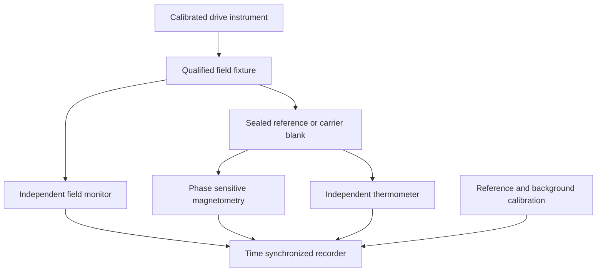
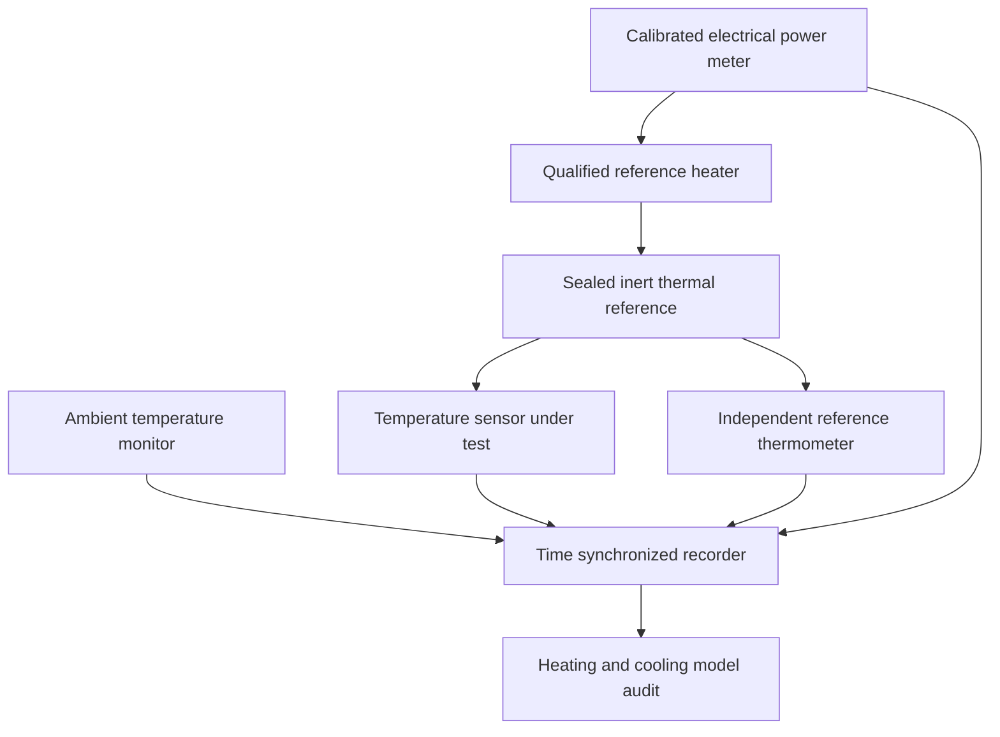

# Nonclinical measurement concepts

26 September 2026. Proposed apparatus blocks for a qualified laboratory, not a construction manual. No sample was exposed or trial run in this project. Browser curves and solver outputs are synthetic model calculations. They cannot measure a real sample through a laptop speaker, replace instrument calibration, establish human benefit or specify a treatment.

The rendered atlas asset `assets/nanoparticle-lab-concept.png` is a conceptual three-station illustration. Its geometry, labels and visible hardware are not a wiring diagram, engineering design, verified bill of materials or evidence of a completed apparatus. A precise vector block diagram should carry the actual measurement logic below.

## Shared sample and calibration record

Use commercially characterized, sealed inert references supplied for laboratory measurement; do not manufacture nanoparticles, open powders, inject materials or use living specimens. Record lot, carrier, stated core and hydrodynamic size distributions, concentration basis, container volume, temperature, storage history and uncertainty. A commercial certificate is evidence about a supplied reference, not proof that its state is unchanged after handling. Check aggregation and position dependence with appropriate calibrated instruments before interpreting a spectral change.

Predeclare the observable, unit, model, excluded measurements, uncertainty, reference state and decisive counterexample. Preserve raw readout, independent drive monitor and calibration trace. Use randomized sample labels with analysis blind to carrier/reference identity where practical; unblind after the analysis procedure is fixed. Record null results and instrument failures. These are proposed controls, not claimed completed work.

## Station M: magnetic phase and energy

Question: does a characterized sealed reference obey a single-time weak-response model over a stated interval? Source basis: NANO-ROS2002; NANO-GOTO2025; NANO-NIST-MPS. The Tesla-inspired part is explicit source/load/phase/loss accounting.

Measure actual H amplitude and phase at the sample, not generator dial settings. Specify whether the output uses H in A/m, B in tesla, peak or RMS amplitude, and susceptibility per total volume or per mass. Preserve field nonuniformity and demagnetization corrections as explicit calibration questions. Estimate χ′ and χ″ from calibrated signals; compare passive cycle work with separately calibrated thermal power only after container/carrier/instrument losses are accounted for.

Controls: carrier-only matched container; source-off baseline; known magnetic reference; drive-only pickup cancellation; sample-position reversal or mapped position dependence; temperature monitoring; harmonics to detect response outside the linear model. Confounds include induced pickup, sensor self-heating, phase delay, coil loss, sedimentation, interactions, aggregation and relaxation-time distributions. Failure of Debye behavior is not evidence of free energy.

No drive current, coil wiring, field exposure, medical dose or power-amplifier construction is specified. The responsible laboratory chooses certified apparatus and its operating envelope under its own engineering controls.

## Station T: thermal inference before nanoparticle interpretation

Question: can a known constant heat input appear frequency- or duration-dependent because of sensor lag and heat loss? This can be answered with a sealed water reference and a professionally assembled, electrically isolated metered heater—without nanoparticles or magnetic heating. Source basis: cooling and instrument controls in NANO-SKIN2025; lumped first-law and scale symmetry are project derivations.

Observable: the residual between independent reference temperature and the sensor model, together with known applied power and cooling response. Predeclared null: a constant-power, constant-C/G model plus independently calibrated sensor lag predicts held-out traces within uncertainty. Falsifier: reproducible residual structure remains after ambient drift and sensor response correction. Strong alternatives are multiple thermal compartments, temperature-dependent G, unmetered heater losses, evaporation/leakage or nonconstant P.

Compare multiple finite analysis windows using a fixed algorithm, including heating and source-off cooling. Never select only the most favorable slope. A heating/cooling trace determines ratios such as P/G and C/G; it does not determine P,C,G independently without an absolute reference. Calibrate sensor response separately where possible, since two time constants can be practically confounded.

## Station O: absorption and optical thermometer

Question: does an optical signal track absorbed heat or merely a changing optical response? Source basis: NANO-SKIN2025 and NANO-TOOL-MIE. Use a commercially sealed reference cuvette and qualified enclosed optical instrumentation; no open beam layout or laser operating recipe is supplied.

The precise diagram should show a calibrated optical source, input reference photodetector, sealed cuvette, separate transmitted/scattered-light channels, optical spectrometer, independent thermometer, carrier blank and a shared recorder. Label optical irradiation separately from magnetic readout if a dual-modality concept is shown. A source arrow means energy supplied by an external instrument.

Observables: absorption/scattering balance, spectrum, independent temperature and thermal response. Controls: carrier/cuvette blank, dark detector, reference optical throughput, thermometer away from direct optical heating, pre/post spectral stability, ambient drift and positional gradients. The null is that temperature differences are explained by independently measured absorbed power and heat transport. Strong alternatives are aggregation, scattering redistribution, reporter changes and local temperature gradients. Extinction cannot simply be relabeled absorption. A bulk well-mixed calibration does not validate local intracellular thermometry.

## Station A: acoustic mechanism and control transfer

A future acoustic fixture should be a professionally qualified microfluidic instrument with sealed inert tracking beads, calibrated pressure/flow measurement and imaging, not an audio healing device. Source NANO-PAVL2025 supports separate acoustic/hydrodynamic force ablations in simulation; NANO-ZHANG2021 demonstrates that electric forces can mediate an acoustically driven device.

The diagram should show drive reference, qualified acoustic fixture, sealed inert channel, pressure calibration, tracer-flow imaging, particle tracking and shared recorder. Mark a separate electrical-field control only for a deliberately hybrid acoustoelectronic design. Do not draw an isolated levitating particle as evidence of antigravity: external forces can balance gravity without changing it.

Observable: trajectory distributions, escape/retention statistics and independently measured flow. Controls: drive off, carrier/background, flow reversal, seed-free comparison, surface-adhesion check and electrical shielding where appropriate to the actual mechanism. The single-well equilibrium variance relation is tested only after checking stationarity and absence of driven flow. Strong alternatives include streaming, hydrodynamic shielding, adhesion, wall effects and particle aggregation.

The atlas audio station is a calibration concept: digital oscillator → measured transducer response → measured physical field. It must display no implied nanoparticle coupling until the intervening transducer and medium are specified. A frequency slider alone supplies no magnetic field, ultrasound pressure or optical irradiation.

## Computing versus physical verification

| Activity | Can be done now in the project | Cannot be inferred from it |
|---|---|---|
| Browser Debye/thermal curves | Inspect declared mathematical trends and units | Real material behavior or body effects |
| Advisor-approved simulations | Test frozen surrogate and numerical identities | Experimental discovery or treatment efficacy |
| Open solver adoption | Reproduce known benchmark after version/license audit | Validity for unmodeled geometry or missing mechanisms |
| Source-ledger and patent review | Track claims, provenance and exact reading depth | Validation from publication, grant or government custody alone |
| Qualified sealed-reference bench | Future measurement after local apparatus review | Anything until measured data and uncertainty exist |

Unknowns to retain in UI: sample distributions, concentration normalization, instrument transfer function, actual absorbed power, thermal gradients, sensor lag, aggregation and applicable model regime. These are measurable missing inputs, not invitations to replace them with an assumed universal frequency.
