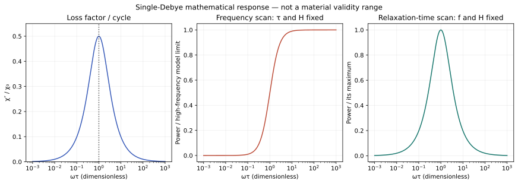
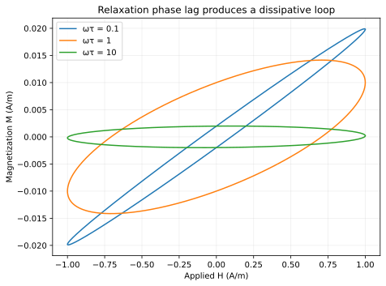

# N1 — loss per cycle and heating power answer different questions

The project hypothesis NP-H1 is supported within the declared single-Debye model:
the loss factor and energy dissipated per cycle peak at omega*tau=1, while power
increases toward a plateau when frequency alone increases at fixed field amplitude,
relaxation time and susceptibility. This is an executed benchmark of established
theory, not a new physical law or an observed nanoparticle effect.

## The model and the distinction

For H=H_peak cos(omega t), the weak-field response is

\[
\chi'=\frac{\chi_0}{1+x^2},\quad
\chi''=\frac{\chi_0x}{1+x^2},\quad x=\omega\tau.
\]

The imaginary-loss convention is chi=chi'−i chi'' with exp(+i omega t), so positive
chi'' means absorption. Energy per cycle and mean absorbed power per unit volume are

\[
W=\pi\mu_0 H_{\rm peak}^2\chi'',\qquad
P=fW=\frac{\mu_0\chi_0H_{\rm peak}^2}{2\tau}
\frac{x^2}{1+x^2}.
\]

Differentiating x/(1+x²) gives (1−x²)/(1+x²)², whereas differentiating
x²/(1+x²) gives 2x/(1+x²)²>0. The two optimization questions therefore differ.
Changing tau while holding frequency fixed gives a different prefactor and power
can peak at x=1; the final panel explicitly checks that contrasting scan.

The synthetic parameters are chi0=0.02, tau=1 microsecond and H_peak=1 A/m.
At x=1, f=159154.943 Hz and P=0.0062831853 W/m³, exactly half the mathematical
fixed-parameter high-frequency limit of 0.0125663706 W/m³. These values normalize
the model; no real material, concentration, field exposure or dose was inferred.
The full x sweep reaches a mathematical frequency of approximately159 MHz.
It is explicitly not evidence that this material model remains valid there.

## A separate dynamic and energy check

The scalar relaxation equation tau Mdot+M=chi0H is integrated from zero
magnetization for60 cycles, at x=0.1,1,10, with512,1024,2048 steps per cycle.
Each run settles for at least37 relaxation times before its final measured cycle.
Multiplying the equation by mu0 Mdot/chi0 yields the passive-element identity

\[
\frac{d}{dt}\left(\frac{\mu_0M^2}{2\chi_0}\right)
=\mu_0H\dot M-\frac{\mu_0\tau\dot M^2}{\chi_0}.
\]

The final term is nonnegative dissipation. It is a specified relaxation-element
budget, not a complete electromagnetic apparatus energy inventory. A second
calculation estimates the loop area −mu0 integral M dH directly from sampled
H and M, independently of the augmented input-work integral. For a nonclosed
trajectory, their difference includes mu0[HM] at the endpoints; this term is
retained rather than silently assuming steady state.

At2048 steps per cycle, input work differs from the analytic periodic value by
at most9.16×10⁻¹¹ relative. The largest normalized all-run budget residual is
1.31×10⁻⁸, equivalent to about3.29×10⁻¹⁶ J/m³ under this normalization.
The independent polygon-loop relative error is about1.57×10⁻⁶ and falls by
approximately4× per doubling of sample resolution, as expected for this sampled
quadrature. Its error is distinct from the RK4 integration error.

Zero field, zero susceptibility and the zero-relaxation-time fixed-frequency
limit give zero absorption. Doubling field amplitude multiplies loss and power
by four only within this assumed linear regime. The calibrated phase ratio
chi''/chi'=omega*tau is separately checked. Ten parameterized checks pass; those
are checks of a few model claims, not ten novel discoveries.

## What an empirical test would need

A conceptual next experiment would use a sealed, characterized reference
specimen, an independently calibrated field/susceptibility measurement, a blank
carrier/reference, and drift and field-amplitude checks over the same specimen's
frequency sweep. It would compare measured phase and loss before inferring heat.
This is a measurement-design proposal, not coil-building instructions or a
nanoparticle preparation, human exposure or treatment protocol.

One prospective project hypothesis is that the apparent relaxation time
tau_app(f)=chi''/(omega chi') stays constant for a calibrated single-Debye response,
but generally changes for a weighted mixture of two relaxation populations.
A frequency-dependent phase-calibration error is a strong rival explanation.
An independently characterized phase reference and held-out frequencies would be
needed to distinguish them. This extension has **not** been executed in N1.
Rosensweig already discusses particle distributions, so neither mixtures nor this
general model comparison should be represented as a first discovery.

## Limits, source and reproduction

Particle size distribution, anisotropy, concentration, interactions, Brownian and
Néel channels, temperature drift and frequency-dependent field amplitude are not
estimated here. Neither the weak-field assumption nor a material frequency range
is empirically certified by selecting a small normalization value. A computed
absorbed power also does not specify a thermometer trace: heat capacity, heat
leakage and sensor response remain separate missing measurements.

Primary basis: Rosensweig(2002), *JMMM*252,**370–374**,
[DOI10.1016/S0304-8853(02)00706-0](https://doi.org/10.1016/S0304-8853(02)00706-0).
The initial frozen contract had an incorrect page range; the explicit
[bibliographic erratum](bibliographic-erratum.md) preserves that history without
changing the model or acceptance thresholds. [sources.md](sources.md) records
reading scope and what its hash does—and does not—bind.

Run `python research/nanoparticles/round1/solver.py`. Inspect
[results.json](results.json), [frequency_sweep.csv](frequency_sweep.csv),
[convergence.csv](convergence.csv) and [final_cycles.csv](final_cycles.csv).
The saved final-cycle trace is sampled every fourth step of the finest integration;
it supports an independent512-segment loop check, while full2048-segment diagnostics
are in the convergence output and regenerate from the source. No subsequent round
is implied by this result; the advisor selects it after review.
