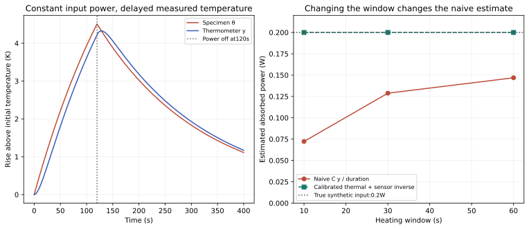

# N2 — thermometer lag can mimic a change in absorption

NP-H2 is supported within the synthetic thermal model. Exactly the same constant
0.2W input appears to be0.0723,0.1288 or0.1469W when inferred from different
finite measurement windows using C*y/t. A calibrated thermal-and-sensor inverse
recovers0.2W in every window. This is a demonstrated analysis artifact in a
declared model, not evidence that a real nanoparticle experiment has that artifact.

## Derivation

The assumed specimen has uniform temperature rise theta and obeys
C theta_dot=P−G theta. A first-order thermometer obeys tau_s y_dot+y=theta.
Here C=4J/K,G=0.02W/K,tau_s=10s; the constant0.2W pulse lasts120s and cooling
continues to400s. The thermal time constant is a=C/G=200s. With b=tau_s,

\[
\theta(t)=\frac{P}{G}(1-e^{-t/a}),\quad
y(t)=\frac{P}{G}\left[1-\frac{a e^{-t/a}-b e^{-t/b}}{a-b}\right].
\]

A finite pulse subtracts a shifted copy of the step response at its end. When
a=b the bracket becomes1−(1+t/a)e^(−t/a). With G=0 it becomes the separate
integrated-ramp response y=(P/C)[t−b(1−e^(−t/b))]. Those removable limits were
tested against independently integrated differential equations.

| Window | Actual specimen rise | Sensor rise | Naive C*y/t | Calibrated estimate |
|---:|---:|---:|---:|---:|
|10s|0.487706K|0.180679K|0.072272W|0.2W|
|30s|1.392920K|0.966120K|0.128816W|0.2W|
|60s|2.591818K|2.203218K|0.146881W|0.2W|

The naive estimate omits both heat loss and thermometer transfer. Very early
sensor rise is quadratic in time, approximately P*t²/(2C*tau_s), so C*y/t
approaches zero, not the input power, as the window shrinks. This does not argue
against appropriate early-slope calorimetry with a sufficiently characterized
sensor; it shows why that characterization matters.

## A stronger rival: absolute power is not identifiable from this trace alone

Multiplying P,C,G together by any positive factor leaves both differential
equations—and the entire temperature trace—unchanged. Factors0.5,2,10 produce
identical traces in the executed control. A good curve fit therefore cannot
establish absolute absorbed power unless an independent calibration fixes the
scale. The positive inverse control assumes C,G and tau_s are already known;
it does not solve their simultaneous unknown calibration problem.

The blank P=0 gives a zero trace. Integrating the specimen's energy balance gives
C*theta=integral P dt−integral G*theta dt. Independent trapezoidal heat-leak
quadrature gives a maximum residual2.35×10⁻⁸J. RK4 trajectory errors fall from
1.63×10⁻¹¹K at0.1s steps to6.49×10⁻¹⁴K at0.025s steps. These small arithmetic
errors say nothing about whether a real specimen is actually spatially uniform
or its thermometer actually follows a single time constant.

## Improved experiment hypothesis and hardware boundary

A prospective discrimination plan would pair short and long input pulses on the
same sealed standard and compare raw and transfer-corrected estimates. A known
electrical-resistor phantom could provide the input calibration; a blank and
two independent temperature channels could check nonparticle heating, drift and
sensor disagreement. Thermometer step response would be characterized separately
from the heating run. These are conceptual controls, not a built apparatus or a
nanoparticle exposure protocol.

The rival constant-absorption explanation predicts agreement of corrected powers
across pulse durations within declared calibration uncertainty. A residual duration
dependence would falsify this particular constant-P transfer model or reveal
miscalibration. It would not uniquely identify a novel absorption mechanism.
Real gradients, convection, changing properties and temperature-dependent source
coupling would need additional discrimination.

Skinner et al.'s optical nanoparticle study motivates attention to mixed-sample
calorimetry, blanks and cooling measurements. N2 independently derives its first
law and explicitly assumes its sensor model; it does not replicate that paper's
efficiency equation or assert magnetic validity from an optical experiment.
See [sources.md](sources.md) for the primary DOI and actual reading scope.

## Reproduce and next missing premise

Run `python research/nanoparticles/round2/solver.py`. The [frozen contract](contract.md),
[results](results.json), [thermal trace](thermal_trace.csv),
[duration comparison](duration_comparison.csv) and [convergence](convergence.csv)
record five substantive checks. The saved trace uses0.5s display samples of the
finest calculation; the source reproduces0.025s budget quadrature.

Even independently calibrated absorbed power does not identify power per particle
without a valid mass/number concentration measurement. Neither particle counts
nor size distribution were modeled in N2. That is an unresolved measurement
premise, not a claim that a subsequent round has already tested it.
