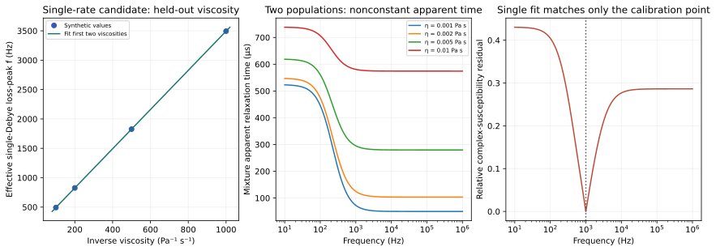

# N3 — a fitted relaxation time need not identify one mechanism

NP-H3 is supported for the two declared synthetic candidates. A single effective
Debye response predicts held-out viscosity changes, while a two-population
mixture can exactly match a fitted single response at one frequency and disagree
substantially elsewhere. This tests an experimental-design idea. It does not fit
or identify the mechanism of a real nanoparticle specimen.

## The candidates are physically different assumptions

With spherical hydrodynamic diameter dh=50nm, T=298K and viscosity eta, the model
Brownian time is tauB=pi*eta*dh³/(2kB*T). The hypothetical Néel time is held
at tauN=1ms; it is not inferred from particle composition or an anisotropy fit.

Candidate A uses one effective time with parallel inverse rates,
tau_eff⁻¹=tauB⁻¹+tauN⁻¹. Candidate B is a sum of equal positive susceptibility
contributions from two different populations, one with tauB and one with tauN.
Adding two population responses is not an alternative algebraic expression for
the same particle's parallel relaxation channels.

For A, writing tauB=beta*eta gives

\[
f_{\rm eff}=\frac{1}{2\pi\tau_{\rm eff}}
=\frac{1}{2\pi\beta}\frac{1}{\eta}+\frac{1}{2\pi\tau_N}.
\]

Fitting the two first viscosities therefore predicts the two held-out values.

| Viscosity | Brownian time | Effective loss-peak frequency | Use |
|---:|---:|---:|---|
|0.001Pa·s|47.7233µs|3494.1085Hz|Fit|
|0.002Pa·s|95.4466µs|1826.6317Hz|Fit|
|0.005Pa·s|238.6164µs|826.1457Hz|Held out|
|0.01Pa·s|477.2329µs|492.6503Hz|Held out|

The fitted intercept159.154943Hz equals1/(2pi*tauN); the held-out relative error
is below1.39×10⁻¹⁵. These are exact-model synthetic data with no measurement
noise. A real fit would need uncertainty in viscosity, size, temperature and phase.

## A single-frequency match is weaker than a mechanism identification

Define tau_app=chi''/(omega chi'). A single-Debye model makes it constant.
For positive populations a,b and relaxation times t1,t2, the mixture gives

\[
\tau_{\rm app}(z)=
\frac{a t_1+b t_2+z(a t_1t_2^2+b t_2t_1^2)}
{a+b+z(a t_2^2+b t_1^2)},\qquad z=\omega^2,
\]

and its derivative is

\[
\frac{d\tau_{\rm app}}{dz}=
-\frac{ab(t_1+t_2)(t_1-t_2)^2}
{[a+b+z(a t_2^2+b t_1^2)]^2}.
\]

It is strictly negative for positive unequal times. Also, tau_app is a
positive-weight mean of t1,t2, so it stays between them. This whole-domain
argument is stronger than observing a decreasing finite sample. The independent
rational expression and complex response agree to below7.56×10⁻¹⁶ relative.

Allowing the rival single model an unknown susceptibility amplitude, choose
tau_fit=tau_app(1kHz) and chi0_fit=chi'(1+(omega*tau_fit)²). It then matches both
complex components at1kHz. At the lowest viscosity the fitted tau is72.6918µs
and chi0_fit=0.0113876, but its maximum held-out relative residual is43.0339%.
The three other viscosity cases give38.5756%,26.1426% and10.6688% residuals.
If susceptibility amplitude were independently known, even the single-frequency
observation could provide an extra discriminating constraint; the ambiguity here
explicitly lets that amplitude be fitted.

When the two times are equal, the mixture collapses to a single response and this
discriminator vanishes. That rival/null control passes. Zero susceptibility also
produces zero response. Five substantive checks passed; these are applications
and controls of known response theory, not five new physical effects.

## Improved empirical hypothesis and rival explanations

A prospective experiment would independently calibrate susceptibility amplitude,
phase and applied field, retain the same characterized specimen across a viscosity
series, and reserve some viscosities and frequencies for prediction. A matched
immobilized reference could help separate motion-dependent and internal response,
while size and concentration checks would test aggregation or changing populations.
These are concepts for an appropriately equipped laboratory; no specimen
preparation, immobilization process or exposure was executed here.

The discriminating project prediction is that a genuinely single effective Debye
response retains constant tau_app within calibration uncertainty, while the
specified positive mixture has a decreasing bounded curve. A frequency-dependent
phase bias, aggregation, changing susceptibility or an unmodeled transfer function
can imitate departures. Without those controls, a nonconstant curve does not
uniquely prove two populations or identify Néel versus Brownian mechanisms.

## Source, limits and reproduction

Rosensweig supplies established relaxation formulas; Goto et al.'s2025
structure-dependent measurements motivate comparison with liquids/solids and
viscosity controls. The manuscript wording about the direction of peak-frequency
scaling was not used as experimental confirmation; the direction here follows
from the displayed assumptions. See [sources.md](sources.md) for reading scope
and the primary publications.

Run `python research/nanoparticles/round3/solver.py`. Inspect the
[contract](contract.md), [results](results.json),
[response spectra](response_spectra.csv) and [viscosity predictions](viscosity_predictions.csv).
Hydrodynamic shape, polydispersity, interparticle interactions, non-Newtonian
response and temperature-dependent parameters remain absent. Even a successful
thermal and relaxation characterization would require a separate particle-number
or mass calibration before a per-particle claim; no such calibration is inferred
from this round. The next question is selected by the advisor after review.
