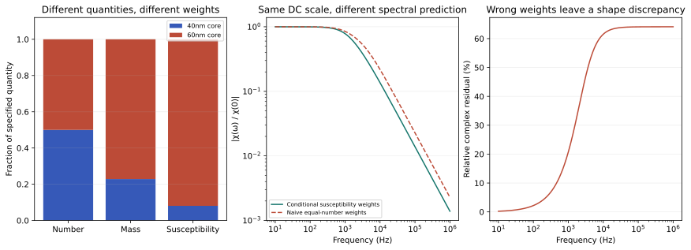

# N4 — count fractions are not magnetic-response fractions

NP-H4 is supported in the conditional synthetic example. Cubing a mean diameter
overestimates particle number by12%, and equal-number response weights give a
different normalized spectrum from the declared equilibrium-susceptibility
weights. This reproduces known moment corrections and tests a project measurement
design; it does not establish the properties of an actual nanoparticle material.

## Core size and hydrodynamic size serve different roles

The two equally numerous populations have core diameters40nm and60nm, but their
separately specified hydrodynamic diameters are50nm and70nm. Core volume sets mass
and the conditional magnetic moment. Hydrodynamic volume sets Brownian drag in
the spherical model. Substituting one diameter for the other would change the
problem without justification.

For a number-weighted diameter distribution, the mean particle core volume is
(pi/6)E[d_core³], not (pi/6)E[d_core]³. Here exact rational arithmetic gives

\[
E[d^3]=140000\ {\rm nm^3},\qquad E[d]^3=125000\ {\rm nm^3},
\qquad\frac{n_{\rm naive}}{n_{\rm correct}}=\frac{28}{25}=1.12.
\]

Using synthetic common density5000kg/m³ and core mass concentration0.001kg/m³
gives2.72837×10¹⁵ particles/m³ from the correct moment, versus3.05577×10¹⁵ from
the mean-diameter approximation. Neither density nor concentration is measured
or assigned to a particular real material. This12% count correction is a known
literature issue, not an equation invented by this project.

## Three different weight families

Under a dilute equilibrium weak-field Langevin model, chi_i is proportional to
number_i times squared magnetic moment. If magnetization density is identical
between cores, moment is proportional to core volume, so chi_i is proportional
to number_i*V_core_i². That additional physical assumption gives:

| Quantity |40nm core population|60nm core population|
|---|---:|---:|
|Number fraction|1/2|1/2|
|Core mass fraction|8/35|27/35|
|Conditional susceptibility fraction|64/793|729/793|

This does not infer an absolute susceptibility or certify the Langevin/locked-moment
regime for real40–60nm particles. Different magnetization densities, interactions,
shape, or relaxation processes would change the weighting model.

## Same DC scale, different held-out shape

For the separate conditional locked-moment Brownian model at298K and0.001Pa·s,
the two hydrodynamic times are47.7233µs and130.9527µs. Normalize the response as

\[
R(\omega)=\frac{\chi(\omega)}{\chi(0)}
=\frac{w_1}{1+i\omega\tau_1}+\frac{w_2}{1+i\omega\tau_2}.
\]

Both the correct susceptibility weights and the naive equal-number weights give
R(0)=1. They nevertheless disagree at nonzero frequencies, by as much as64.1021%
in relative complex response on the declared10Hz–1MHz mathematical grid. The
largest discrepancy occurs at its upper endpoint; this is not a demonstrated
material-validity range or an experimentally optimized operating point.

An independent rational expression,
[1+i*omega*(w1*tau2+w2*tau1)]/[(1+i*omega*tau1)(1+i*omega*tau2)], agrees with
the sum of responses to below4.70×10⁻¹⁶ relative. Relabeling both paired sizes
leaves the answer unchanged, and a monodisperse case collapses to a single
response. These controls and the exact moment tests form five substantive gates.

## Improved empirical hypothesis and strong rivals

An improved prospective test would measure core-size number distribution,
hydrodynamic sizes and total core mass independently, then predict frequency
responses that were not used for DC normalization. A mismatch between those
predictions and phase-calibrated spectra would test the weighting assumptions.
An intensity-weighted optical size estimate cannot silently substitute for a
number-weighted core-size distribution.

Aggregation, nonspherical particles, unequal magnetization density, altered
hydrodynamic coatings, concentration error and an unmodeled Néel channel remain
strong alternative explanations. This round deliberately omits a Néel channel;
it is not the identical material model used in N3. No synthesis, coating process,
exposure, clinical effect or actual apparatus was tested.

## Source and reproduction

Farkas et al.(2025), *Analytical Chemistry*97,10999–11006,
[DOI10.1021/acs.analchem.4c05990](https://doi.org/10.1021/acs.analchem.4c05990),
provides the existing particle-number/moment context. The conditional magnetic
weighting is separately derived from the weak-field Langevin model discussed by
Rosensweig, not attributed to Farkas. Reading scope is in [sources.md](sources.md).

Run `python research/nanoparticles/round4/solver.py`. Inspect
[contract](contract.md), [results](results.json),
[population weights](population_weights.csv) and [weighted response](weighted_response.csv).
These model predictions still require an actual calibrated drive spectrum at the
specimen. An audible beat rate or a software setting alone does not specify that
drive. That measurement boundary remains for the advisor's final-round decision.
