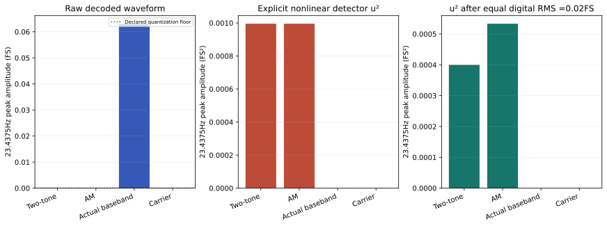
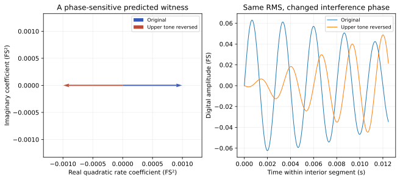

# N5 final — an envelope rate is not automatically a physical drive component

NP-H5 is supported by the actual OpenSync NanoLab WAV files and the declared
observation models. The two-tone and AM files have negligible raw23.4375Hz
components, but squaring their samples produces that rate. Reversing one tone's
phase preserves digital RMS and reverses the quadratic difference-frequency
coefficient. This is a reproducible signal-processing discrimination result,
not measured nanoparticle motion or a physiological effect.

## Actual executable evidence

The analysis decodes four production-rendered PCM16 stereo files:2s,48kHz,
375Hz carrier,23.4375Hz rate and−24dBFS gain. Left and right channels are identical.
It analyzes4096 interior samples beginning at frame32768, away from50ms fades;
every specified tone completes an integer number of cycles in that window.
The actual adapter, synthesis, encoder and spectrum-preview source snapshots,
standalone executable bundle, WAVs and manifests are frozen by [inputs.json](inputs.json).
Regeneration through that bundle reproduced all WAV and manifest bytes exactly.

Let g=10^(−24/20). The ideal two-tone signal is

\[
u(t)=\tfrac{g}{2}\{\sin[2\pi(f_c-r/2)t]+\sin[2\pi(f_c+r/2)t]\}.
\]

Its linear spectrum has363.28125Hz and386.71875Hz components, not a23.4375Hz
component. Its equivalent signed envelope is cos(pi*r*t); the envelope's absolute
magnitude repeats at rate r. The AM file has351.5625,375 and398.4375Hz components.
The baseband control actually contains23.4375Hz, and the carrier control contains375Hz.

## The observation operator changes the answer

A declared linear time-invariant frequency response H(f)=1/(1+i*f/200Hz)
attenuates and phase-shifts existing components. It cannot create a new rate
component. A separate explicitly nonlinear detector q=u² does create mixing
components through the product-to-sum identities.

| Actual file | Interior RMS (FS) | Raw rate amplitude (FS) | Squared-detector rate amplitude (FS²) |
|---|---:|---:|---:|
|Two-tone|0.0315471|4.43×10⁻⁷|0.000995217|
|AM|0.0273209|3.98×10⁻⁷|0.000995251|
|Actual baseband|0.0446144|0.0630943|8.40×10⁻⁸|
|Carrier|0.0446154|0|0|

For the ideal two-tone signal, q has a rate component of amplitude g²/4.
For AM it also has a rate component g²/4 and a2r component g²/16. A baseband
sine squared produces DC and2r rather than r. The carrier squared produces DC
and2fc. The small nonzero residuals in decoded files are retained and checked
against quantization bounds, not relabeled mathematically exact zero.

FS denotes digital full-scale amplitude; FS² is its square. Neither is pascals,
newtons, magnetic-field strength, absorbed watts or a particle displacement.
Equal peak settings also do not give equal mean-square amplitudes. After an
analysis-only normalization to0.02FS RMS, the pair's quadratic rate amplitude is
0.000399999FS² and AM's is0.000533337FS². The nonlinear scaling follows the square
of the applied gain. Equal digital RMS still does not equalize physical energy
delivered by an uncharacterized actuator.

## A phase-sensitive discrimination experiment

The stronger prospective prediction reverses the upper two-tone component's
phase while holding both component magnitudes and digital RMS fixed. The code
does this on the actual decoded signal by changing the sign of DFT bin33 and
performing a real inverse transform. The quadratic rate coefficient moves from
+0.000995217 to−0.000995190FS² in its real component, with sum residual
2.69×10⁻⁸FS²; RMS is unchanged to the saved precision.

A calibrated witness channel exhibiting that phase reversal would support a
particular mixing route. It would not by itself locate that route in particles:
the amplifier, transducer, sensor electronics, clipping, detector processing or
hydrodynamic coupling could generate a similar term. A truly linear channel has
the changed upper-tone phase but no newly created rate component. These competing
predictions make the phase reversal more informative than simply comparing loudness.

## Hardware boundary and a better empirical design

A future inert-phantom study would need a measured chain: digital signal to line
voltage, characterized transducer, calibrated pressure or acceleration witness,
and a sealed reference specimen. Different transducers can have different gains,
phases and nonlinearities. If a magnetic-drive model were intended instead,
the conversion to field strength would require its own independently calibrated
hardware. The audio file specifies none of these conversions.

A nanoparticle force model would additionally require material/fluid contrast,
spatial gradients, geometry, damping and a justified regime. Acoustic streaming,
thermal drift, sensor nonlinearity and ordinary bulk motion are rivals. The
quadratic detector here is an explicit mathematical comparison, not a radiation
force law or a measurement of those mechanisms. No apparatus was built and no
human, particle exposure, synthesis or injection experiment occurred.

## Numerical limits and reproduction

The conservative sample error bound epsilon=2⁻¹⁵FS gives a raw Fourier-line
bound2epsilon=2⁻¹⁴FS. For |u|<=g, a squared-line bound is
2(2g*epsilon+epsilon²)=7.71×10⁻⁶FS², below the frozen10⁻⁵FS² tolerance.
All observed errors were substantially smaller. The coherent interior-window
calculation differs from the application's Hann-window preview; endpoint fades
and arbitrary off-bin windows produce leakage and should not be treated as exact
line measurements.

Run `python research/nanoparticles/round5/solver.py` to analyze the stored evidence.
Run `node research/nanoparticles/round5/regenerate_assets.mjs` to verify exact
production regeneration, or add `--write` to restore those same bound assets.
Inspect [results](results.json), [decoded spectra](decoded_spectrum.csv),
[comparison table](signal_comparison.csv), [source record](sources.md) and
[frozen contract](contract.md). Five substantive gates passed.

This is the fifth and final executed nanoparticle research round. The scientific
outcome is a sequence of validated model tests and falsifiable measurement designs,
with their calibration requirements explicit. No sixth nanoparticle round or
unmeasured physical effect is implied.
