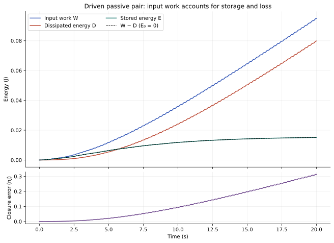
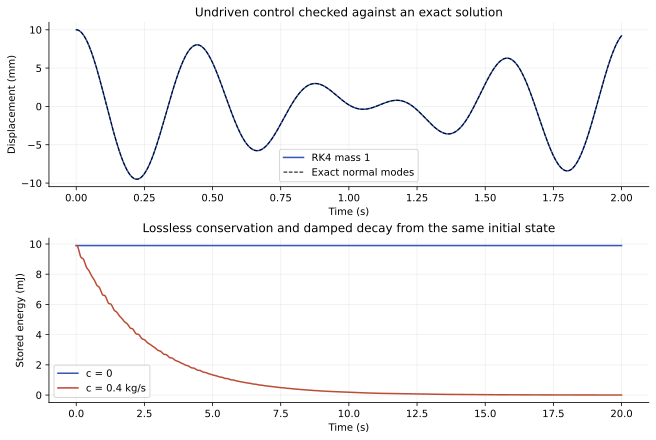
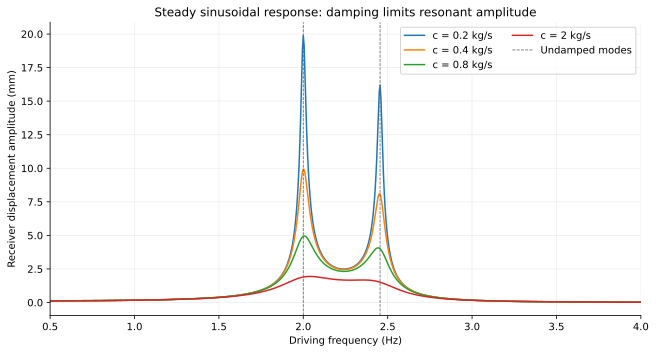
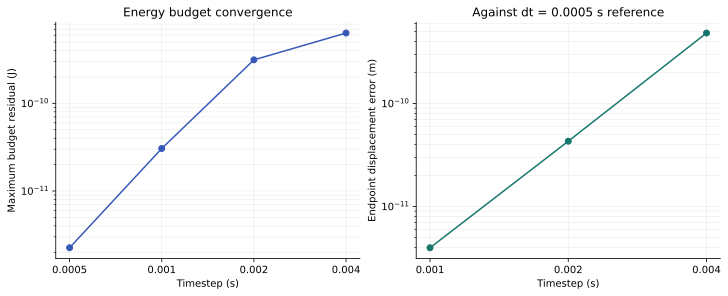

# Round 1 — resonance with an explicit energy budget

The executed model passes all 15 predeclared production checks and four focused
implementation checks. Resonance increases displacement, while the supplied work
accounts for stored energy and dissipated energy. This is a reproducible
application of standard linear mechanics, not a new energy source or a physical
test of a biological, occult, or antigravity claim.

## What was calculated

Two 1 kg masses each connect to a fixed support through a 157.913670417 N/m spring
and a 0.4 kg/s damper. A 40 N/m spring couples the masses. A sinusoidal force of
amplitude 0.1 N acts on the first mass. The baseline starts at rest, uses a 2 Hz
drive, and runs for 20 s. All parameters and thresholds were frozen in
[contract.md](contract.md) before implementation and execution. The model has
undamped normal frequencies of 2.000000000 and 2.454877527 Hz.

For constant symmetric matrices, differentiating the kinetic and potential
energies gives

\[
E=\tfrac12\dot q^T M\dot q+\tfrac12q^T Kq,\qquad
\dot E=\dot q^T(M\ddot q+Kq)
=uB^T\dot q-\dot q^TR\dot q.
\]

The last term is nonnegative loss because R is positive semidefinite. Integration
gives E(t)−E(0)=W_in(t)−D(t). The coupling spring contributes
kc(q1−q2)²/2 to E; its equal and opposite internal forces do not supply energy.
This derivation is exact within the specified constant linear model.

## Main result

| Quantity at 20 s | Computed value |
|---|---:|
| Initial stored energy | 0 J |
| Work supplied by the external force | 0.0949329661411 J |
| Dissipated energy | 0.0798147902954 J |
| Remaining stored energy | 0.0151181761588 J |
| Endpoint closure residual | 3.1303 × 10⁻¹⁰ J |
| Largest absolute closure residual during the run | 3.1374 × 10⁻¹⁰ J |
| Endpoint residual / fixed-rule budget scale | 3.2973 × 10⁻⁹ |

The scale in the last row is max(|W_in|,E0,E_final,D,10⁻¹² J), evaluated at
the endpoint. It is a reporting denominator; it is not a physical calibration.



## Discriminating controls

| Control | Observed result | Interpretation within this model |
|---|---|---|
| No input, nonzero initial displacement, no damping | Relative energy drift 8.5903 × 10⁻⁸ over 20 s; exact normal-mode displacement error 1.5638 × 10⁻⁸ m | Coupling exchanges stored energy; the RK4 trajectory approximates the exact conservative solution. |
| No input, same initial displacement, positive damping | Energy falls from 0.009895683521 to 0.000003342361 J; no sampled increase | The dampers remove stored energy. |
| No coupling, receiver starts at rest | Receiver displacement and velocity remain exactly zero in the calculation | The chosen model transfers no energy to the disconnected receiver. |
| No input, both masses at rest | All motion, input work, and dissipation remain exactly zero | The solver does not create spontaneous oscillation. |
| Drive moved from 2 to 3.5 Hz | First-mass final-5-s RMS falls from 0.00685651 to 0.000252202 m | The off-resonance response is lower for these parameters. |
| Reverse velocity after 5 s without input or damping | Return errors: 2.3571 × 10⁻¹⁰ m and 7.9181 × 10⁻¹⁰ m/s | The conservative time-reversal symmetry is recovered numerically. |
| Negate initial state and drive together | Opposite motion; energy/work/loss agree exactly in this run | Linear sign symmetry holds; this is distinct from reversing dissipative time evolution. |
| Deliberately omit dissipated energy from the budget | Apparent closure error −0.07981478998 J | A missing loss term produces a large wrong answer, about 2.55 × 10⁸ times the correct endpoint residual. |



## Independent frequency-domain check

For a sinusoidal force, the displacement phasor satisfies
(K−ω²M+iωR)Q=BF. With V=iωQ, the cycle-averaged input and loss powers are
½ Re[(BF)ᴴV] and ½ VᴴRV. Their difference is zero in exact steady state:
the mean change in stored energy over a complete period is zero.

The code solves this 2×2 complex matrix equation independently of the scalar
time-step equations. At 2 and 3.5 Hz, amplitudes fitted from the last 10 s of a
60 s simulation agree with the analytic amplitudes to at worst 1.9651 × 10⁻⁵
relative error. This discrepancy includes remaining transient motion as well as
time-step error; the fit is not asserted to be exact steady state.

The sweep includes 701 frequencies from 0.5 to 4 Hz for each of four damping
values: 0.2, 0.4, 0.8, and 2 kg/s. Maximum absolute mean-power discrepancy is
3.4694 × 10⁻¹⁸ W. The curves show finite responses near the two normal modes.
The plotted peak positions use a 0.005 Hz grid, so they are not exact optimized
peak locations. No lossless finite response is asserted at exact resonance.



## Numerical uncertainty and convergence

| Timestep | Maximum budget residual | Endpoint displacement error against finest run | Endpoint velocity error against finest run |
|---:|---:|---:|---:|
| 0.004 s | 6.3465 × 10⁻¹⁰ J | 4.8328 × 10⁻¹⁰ m | 5.3693 × 10⁻⁷ m/s |
| 0.002 s | 3.1374 × 10⁻¹⁰ J | 4.3001 × 10⁻¹¹ m | 3.3416 × 10⁻⁸ m/s |
| 0.001 s | 3.0554 × 10⁻¹¹ J | 3.9664 × 10⁻¹² m | 1.9648 × 10⁻⁹ m/s |
| 0.0005 s | 2.2519 × 10⁻¹² J | Reference | Reference |

The closure residual decreases at every refinement, but it is not a reliable
standalone estimator of state error or a clean fourth-order slope: different
error terms can cancel. Endpoint velocity convergence and the independent
conservative exact solution give separate evidence about trajectory accuracy.
The finest run is a numerical reference, not an exact solution of the driven
problem. These checks are finite-run numerical evidence, not an interval-certified
error bound or an all-time theorem. There is no statistical sampling uncertainty;
there is floating-point arithmetic error, integration truncation, frequency-grid
resolution, and untested physical model assumptions.



## What this enables and what remains missing

This round supplies an inspectable baseline for studying a resonant apparatus:
specify coordinates and energy storage, account for every external drive and
dissipative channel, and check measurements against the passive prediction.
An observed large amplitude by itself would not establish an extra energy source.

No human frequency, healing effect, Schumann-cavity coupling, gravity modification,
or material transformation was calculated. Those topics require different
constitutive models and observations. Even a perfect fit of a small oscillator
model would not identify a unique physical mechanism without independent
measurements. The next research question is for the advisor to select after
independent review; this directory executes only Round 1.

## Reproduce and inspect

From the repository root:

```sh
python -m unittest discover -s research/round1 -p 'test_solver.py' -v
python research/round1/solver.py
```

The calculation uses Python 3.12.14, NumPy 2.3.5, and Matplotlib 3.10.8 in the
recorded run. Python 3.10+ with NumPy and Matplotlib is sufficient. There are no
network calls, random draws, fitted model parameters, or hidden datasets.

- [results.json](results.json): complete observed values and acceptance outcomes,
  with hashes binding the frozen contract, solver, and focused test source.
- [baseline.csv](baseline.csv.gz): every 0.002 s sample, sufficient for independent
  energy and power-quadrature recomputation.
- [frequency_sweep.csv](frequency_sweep.csv.gz): analytic amplitude and mean-power data.
- [convergence.csv](convergence.csv.gz): all four timestep runs.
- The remaining control CSVs use every tenth integration step (0.02 s), which is
  distinct from the 0.002 s timestep used for computation and acceptance tests.
- Four figures are supplied as both editable SVG and PNG.

The four unit tests additionally check the instantaneous energy gradient against
the scalar equations, the uncoupled response against a scalar complex formula,
rejection of parameters outside the declared passive family, and an incompatible
duration/timestep pair. They supplement the 15 production checks in results.json.
