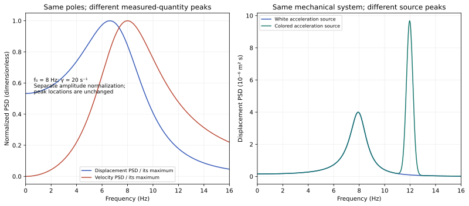

# Round 2 — a spectral peak is a property of a measurement and its source

The same oscillator can produce different displacement and velocity peak
frequencies, and the same displacement spectrum can come from different
oscillators if their driving sources are unknown. The round passes nine original
checks and one explicitly review-added source-evenness check. These are exact
synthetic model comparisons, not human or Earth measurements.

The advisor selected this question because Round 1's energy accounting did not
identify a unique map from an observed spectrum to a physical mechanism.

## Derivation

For x''+2 gamma x'+omega0² x=d, set y=omega². The displacement PSD under a
calibrated unit white acceleration source is

\[
S_x(\omega)=\frac{1}{(\omega_0^2-\omega^2)^2+4\gamma^2\omega^2},
\qquad S_v(\omega)=\omega^2 S_x(\omega).
\]

The denominator is y²+(4 gamma²−2 omega0²)y+omega0⁴. Its minimum on y≥0
occurs at max(omega0²−2 gamma²,0). Thus the displacement peak is at
sqrt(max(omega0²−2 gamma²,0)). Differentiating y/denominator gives a numerator
omega0⁴−y², so the positive-frequency velocity peak is at omega0 for gamma>0.
The poles −gamma±sqrt(gamma²−omega0²) are unchanged by reporting displacement
or velocity. These are different observables of the same state.

With f0=8 Hz and gamma=20 s⁻¹, displacement peaks at 6.613302 Hz while velocity
peaks at 8 Hz. Once gamma≥omega0/sqrt(2), displacement peaks at zero frequency;
that is a nonoscillatory maximum of the PSD, not a new oscillation at zero Hz.
All five cases agree with the 0.001 Hz numerical grid within 0.0011 Hz.

## Why an unknown source blocks unique reconstruction

For two transfer functions H1 and H2 that are nonzero on the sampled band, choose
S_d2=|H1|² S_d1/|H2|². Then |H2|² S_d2=|H1|² S_d1. The example uses
(f0,gamma)=(8 Hz,5 s⁻¹) versus (10 Hz,8 s⁻¹), which have different poles,
yet their output PSDs match to a maximum relative error of 2.15 × 10⁻¹⁶.
The constructed second source is finite and positive over the band. This is an
explicit nonuniqueness example, not evidence that a particular real source has
that spectrum.

Holding the oscillator fixed and adding a source bump near 12 Hz moves its output
peak from 7.920 to 11.963 Hz. Nothing in its mechanical poles changes. The
positive-frequency source curve is extended evenly to negative frequencies to
describe a real stationary drive. That domain clarification and its exact test
were added after the first execution and before the reviewed rerun; see
[contract-clarification.md](contract-clarification.md). The original
[contract.md](contract.md) is preserved.

## Positive recovery control

If the model family and source amplitude are known, 1/S_x is a polynomial in
omega² with coefficients 1, 4 gamma²−2 omega0², and omega0⁴. Fitting exact
synthetic data at 1,4,8,12,18 Hz recovers f0=8.000000000000005 Hz and
gamma=5.000000000000091 s⁻¹. This does not show recovery from noisy, finite
records or from an unknown source. It identifies a missing condition for unique
reconstruction within the declared family: calibration and model validity.

## Scope and reproduction

No universal “frequency of a human” is estimated. A human has many measurable
signals and modes; this mechanical counterexample only shows why an unspecified
single peak would be ambiguous. The ideal spherical-cavity formula
c sqrt(l(l+1))/(2 pi R) solves a different electromagnetic idealization and is
not a calibration of this mechanical model. No Schumann-frequency prediction or
Earth-body coupling inference follows from the selected value f0=8 Hz.

Run `python research/round2/solver.py` from the repository root. Inspect
[results.json](results.json), [spectra.csv](spectra.csv.gz), and
[source_ambiguity.csv](source_ambiguity.csv.gz). CSV units use a two-sided
angular-frequency PSD convention: variance=(1/(2 pi)) integral S(omega)domega.
The horizontal display coordinate is f=omega/(2 pi); the stored PSD values have
not been redefined as a one-sided per-Hz PSD. Relative plot heights for x and v
are normalized separately, because their physical units differ.
