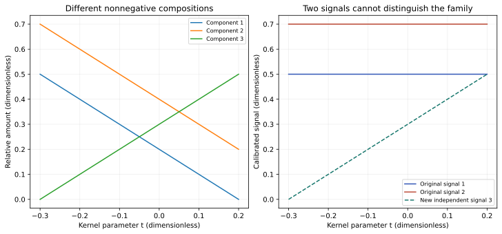

# Round 3 — an observation need not identify a composition

Five exact or numerical checks pass. Two hypothetical assay signals permit a
continuous family of different nonnegative component amounts. An independent
third signal removes this ambiguity in the noise-free model; repeating the first
signal does not. This supplies a question to ask of historical laboratory notes:
what additional observation could distinguish competing interpretations?

It does not reconstruct an actual alchemical procedure or prove any material
transformation. The components and linear assay coefficients are invented for
this mathematical example and have no assigned chemical identities.

## Exact derivation

Let A=[[1,0,1],[0,1,1]] and c=(1/5,2/5,3/10). The observed signals are
y=(1/2,7/10). Since A(−1,−1,1)ᵀ=0, every

\[
c(t)=(1/5-t,\;2/5-t,\;3/10+t),\qquad -3/10\leq t\leq1/5
\]

is nonnegative and produces exactly the same y. The interval follows by solving
each component's nonnegativity inequality. This algebra establishes the whole
family; the 101 saved rational samples are illustrative checks.

| Measurement matrix | Rank | Domain dimension | Nullity | What is identified? |
|---|---:|---:|---:|---|
| Two original rows | 2 | 3 | 1 | A one-dimensional family remains |
| Add independent row (0,0,1) | 3 | 3 | 0 | All three components in exact noiseless data |
| Repeat row (1,0,1) | 2 | 3 | 1 | The original ambiguity remains |

With the independent signal z=c3, the inverse is explicit:
c3=z, c1=y1−z, c2=y2−z. Rational arithmetic reconstructs the reference and
both interval endpoints exactly; a separate floating-point solve differs by at
most 5.56 × 10⁻¹⁷. The endpoint compositions (1/2,7/10,0) and (0,1/5,1/2)
remain indistinguishable under the duplicate-signal control.

The original 2×3 matrix returns two nonzero singular values, sqrt(3) and 1.
That does not mean it is injective: its domain is three-dimensional and has a
nonzero kernel. Also, the components are relative amounts, not fractions summing
to one. Their endpoint sums are 6/5 and 7/10. Adding a sum constraint would add
information that this example does not possess.

## Remaining issue and reproducibility

Full rank only establishes noiseless uniqueness within this specified model.
It does not establish stable recovery from noisy or poorly calibrated assays,
nor prove that a real material obeys the assumed response coefficients. The
advisor must review these outputs before selecting the next noise/conditioning
question.

Run `python research/round3/solver.py` from the repository root. The
[contract](contract.md) predates execution; [results.json](results.json) binds it
to the source hash. The [composition family CSV](composition_fiber.csv.gz) preserves
the exact rational values rather than rounded decimal approximations. The SVG
and PNG use decimal coordinates solely for display.
