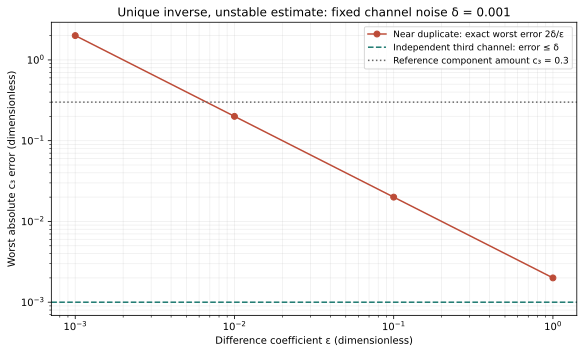

# Round 4 — unique reconstruction can be unstable

The added assay can make the model algebraically invertible and still provide a
poor reconstruction under small measurement errors. Seven frozen checks pass,
including exact worst-case error bounds and a duplicate-row negative control.
The advisor selected this question from Round 3's assumption of noiseless data.

## Derivation and observed values

The first two signals are y1=c1+c3 and y2=c2+c3. A nearly repeated third
signal is y3=c1+(1+epsilon)c3. Subtracting gives

\[
c_3=\frac{y_3-y_1}{\epsilon},\qquad
\Delta c_3=\frac{\eta_3-\eta_1}{\epsilon},\qquad
|\Delta c_3|\leq\frac{2\delta}{\epsilon}.
\]

The bound is attained by eta3=delta and eta1=−delta. Inserting this estimate
into c1=y1−c3 and c2=y2−c3 gives exact component bounds
delta(1+2/epsilon), delta(1+2/epsilon), and 2delta/epsilon.
The inverse is affine in the errors, so extrema over the rectangular error set
occur at its corners. Exact rational evaluation of all eight corners confirms
every bound, without relying on random sampling.

| Difference coefficient epsilon | Largest c3 error, delta=0.001 | Matrix 2-norm condition number |
|---:|---:|---:|
| 1 | 0.002 | 8.34 |
| 0.1 | 0.02 | 55.47 |
| 0.01 | 0.2 | 534.95 |
| 0.001 | 2 | 5330.55 |

All four matrices have determinant epsilon and rank 3. At epsilon=0, the third
row duplicates the first and rank falls to 2. For comparison, an independent
third channel y3=c3 has bounds (0.002,0.002,0.001) under the same per-channel
absolute error limit.

The nominal c3 amount is only 0.3. At epsilon=0.001 its possible reconstruction
error of 2 is much larger than the amount being estimated. Four of the eight
error corners yield at least one negative unconstrained component. Those values
are retained as a failure of the unconstrained reconstruction's stability; they
are not physically negative material amounts. A nonnegative or prior-constrained
estimator would be a different model with different bias and uncertainty.

## Assumptions matter

This comparison fixes the actual assay coefficient rows and an absolute error
bound of 0.001 in each calibrated dimensionless signal. Renormalizing a row while
leaving its noise bound unchanged would change the experiment. The independent
channel is a useful control within these assumptions, not a universal optimal
sensor. The error bounds are worst-case deterministic limits, not confidence
intervals or measured noise distributions.

An independently measured total amount could also add information to Round 3's
toy ambiguity. The absence of a sum-to-one constraint there is a declared premise,
not a universal assertion about chemical analysis. Real assay coefficients,
calibration drift, correlations and detection limits remain unmeasured here.

## Reproduction

Run `python research/round4/solver.py`. Inspect [results.json](results.json),
[noise_corners.csv](noise_corners.csv.gz), and the pre-execution
[contract](contract.md). Rational arithmetic gives the bounds and corner results;
independent NumPy linear solves differ by at most 2.23 × 10⁻¹³. No chemical,
human, or stochastic experiment was performed. The next round awaits advisor
review and selection.
