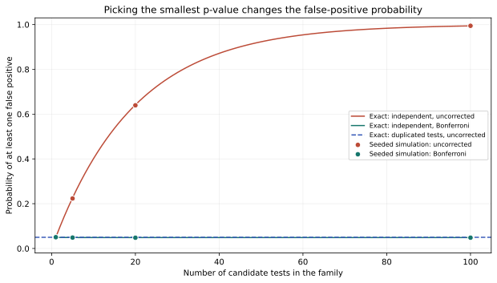

# Round 5 — choosing the best-looking analysis changes its error rate

Trying many individually valid tests and reporting only the smallest p-value can
make a false positive likely. Exact calculations and a seeded simulation agree
in this ideal null model. This round follows the fourth round's lesson that
measurements must be stable: stability alone does not protect an analysis chosen
after inspecting many candidate results.

## Exact probability calculation

If each of m independent null p-values is uniform on [0,1], the chance that every
one exceeds alpha is (1−alpha)^m. Therefore

\[
\Pr(\min_i p_i\leq\alpha)=1-(1-\alpha)^m.
\]

Using the Bonferroni threshold alpha/m gives 1−(1−alpha/m)^m under independence.
More generally, the union bound gives a familywise false-positive probability
at most m(alpha/m)=alpha under any dependence, provided the individual p-values
are valid and the complete family is correctly specified.

| Candidate tests | Exact uncorrected probability | Exact Bonferroni probability | Seeded uncorrected rate | Seeded corrected rate |
|---:|---:|---:|---:|---:|
| 1 | 5.000% | 5.000% | 5.054% | 5.054% |
| 5 | 22.622% | 4.901% | 22.340% | 4.874% |
| 20 | 64.151% | 4.883% | 63.944% | 4.812% |
| 100 | 99.408% | 4.878% | 99.450% | 4.834% |

These percentages describe synthetic null test families, not the probability
that an individual hypothesis is false or true. In particular, a p-value is not
the probability that a claim is true.

## Dependence control

If all m reported tests duplicate the same p-value, they are perfectly correlated.
The uncorrected false-positive probability remains alpha, while the Bonferroni
probability is alpha/m. Applying the independent-tests formula to duplicated or
overlapping tests would give the wrong exact rate. The union-bound guarantee
still applies but can be conservative. This parallels the earlier distinction
between a genuinely independent observation and repeating the same information.

## What changes in an experimental plan

The endpoint, measurement window, target category, inclusion rule and stopping
rule must be fixed before looking at outcome data. Exploratory searches can
still be valuable, but their selected findings need appropriately designed
confirmation. The family of analyses includes variations in frequencies, sensors,
time windows, candidate materials, hypotheses and scoring rules that actually
contributed to selecting a result; an undisclosed search cannot be corrected by
counting only the final reported tests.

This round does not calculate the exact rate for sequential stopping, which has
overlapping data and dependent tests. The advisor will select the final round
after reviewing this result. A finite concealed-target toy model can make those
dependencies and the role of information leakage explicit.

## Reproduction and uncertainty

Run `python research/round5/solver.py`. It uses 50,000 synthetic studies and
NumPy seed 20260926. Exact rational rates are the principal result; the Monte
Carlo points are an illustration checked against predeclared tolerances. There
are 28 parameterized checks covering the four family sizes, dependence controls,
correction subsets and simulation agreement—not 28 separate discoveries.

Inspect [results.json](results.json), [familywise_rates.csv](familywise_rates.csv.gz),
and [synthetic_minima.csv.gz](synthetic_minima.csv.gz). The last file preserves
every study's minima and duplicate-control value, with exact raw and compressed
hashes. Original p-value arrays regenerate deterministically from the seed.
The [contract](contract.md) records simulation size and tolerances before execution.
No real participant, dream, laboratory signal, or historical claim was tested.
