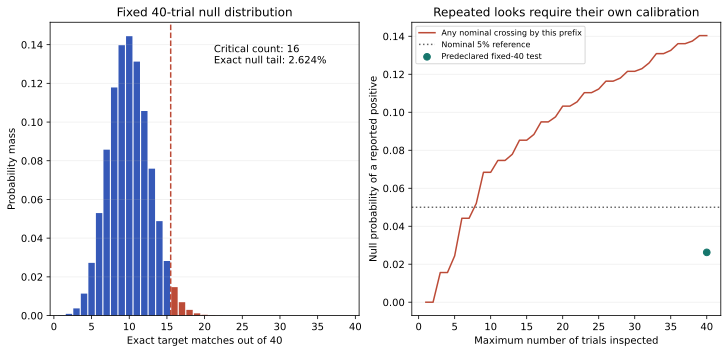

# Round 6 final — calibrating a proposed concealed-target test

This final round is a synthetic methodology benchmark, not an experiment showing
lucid dreaming, astral travel or external perception. Seven frozen checks pass.
The model separates a person's report of an experience from a prespecified
claim about information unavailable through ordinary channels.

## Primary fixed-count result

With 40 independent trials, four uniformly selected target labels and one fixed
response per trial, chance performance has K~Binomial(40,1/4). The exact
one-sided chance tail is

\[
\Pr(K\geq k)=\sum_{j=k}^{40}\binom{40}{j}(1/4)^j(3/4)^{40-j}.
\]

At the predeclared nominal 5% level, the smallest qualifying count is **16 exact
matches out of 40**. Its chance tail is **2.624488%**; 15 matches gives 5.443725%
and does not qualify. The discrete cutoff is conservative relative to 5%.
These are probabilities under a model, not probabilities that a metaphysical
explanation is true or false.

The deliberately simple synthetic validation always guesses label 0 while targets
remain uniform and independent. It still has chance success 1/4, illustrating
that a response preference does not increase accuracy against such targets.
Across 50,000 seeded synthetic studies, 1,318 meet the fixed threshold (2.636%).
No participant dream reports or sleep-state recordings were generated.

## What repeated early checking changes

At each prefix n=1,...,40, a naive analyst could compute that prefix's nominal
5% binomial tail and stop at the first qualifying score. These overlapping
tests are dependent. The exact chance of ever qualifying is **14.037319%**,
computed by absorbing-state dynamic programming; the synthetic rate is 13.890%.
Applying the independent-tests formula from Round 5 would give the wrong answer.

For each prefix, unabsorbed probability mass at hit count k branches to k+1
with weight 1/4 and to k with weight 3/4. A branch reaching that prefix's cutoff
is moved to an absorbing “reported positive” state. Remaining plus absorbed
mass equals 1 exactly at every step. An independent weighted enumeration of all
4,096 binary hit/miss paths through 12 trials gives the same 12-trial crossing
probability, 78277/1048576. Each path is weighted by its chance probability;
the binary paths are not equiprobable.

## Ordinary leakage is a positive control

Suppose the target is known through an ordinary leak with probability lambda,
and guessing is otherwise at chance. Then p_hit=lambda+(1−lambda)/4.
Using the same 16-of-40 cutoff gives:

| Disclosed leakage probability | Per-trial success probability | Probability of reaching the fixed cutoff |
|---:|---:|---:|
| 0 | 0.25 | 2.624488% |
| 0.1 | 0.325 | 19.780745% |
| 0.5 | 0.625 | 99.883149% |

This control shows that above-chance performance does not identify its mechanism.
It does not estimate how much leakage occurs in any real study. Sensory cues,
experimenter knowledge, target files, browser state, flexible scoring and selective
reporting would require separate checks.

## Proposed observations and a future test

A sleep-friendly observation can preserve an ordinary schedule and record a
report after natural waking, before interpreting it. Keep dream recall, awareness
of dreaming, experienced self-location, confidence and later interpretation in
separate fields. “No dream recalled” is a valid entry. A journal alone does not
establish REM sleep or the acquisition of concealed information.

A future target study would need independent target custody outside the
participant's browser, a locked response before revelation, exact label scoring,
fixed trial count, and prespecified handling of missing responses and invalidated
trials. It would require independent review appropriate to the actual design.
No such system or human study is implemented in this benchmark. The simple
binomial model assumes independent uniform assignments and valid trial inclusion;
clustering, nonuniform targets or data-dependent selection need a different
calibration. A positive result would first be a discrepancy under an audited null,
requiring leakage/error investigation and replication before a mechanism claim.

The pre-execution source/design packets are preserved as
[dreams-preparation.md](dreams-preparation.md) and
[dream-review.md](dream-review.md). They distinguish first-person reports,
physiological sleep-state evidence and concealed-target accuracy, and record the
primary sources actually inspected by the separate researchers. Their prospective
wording documents preparation before this calculation; it is not a claim that
the final synthetic computation remains unexecuted.

## Reproduction and final boundary

Run `python research/round6/solver.py`. Read [results.json](results.json),
[binomial_null.csv](binomial_null.csv.gz), [stopping_boundaries.csv](stopping_boundaries.csv.gz),
and [synthetic_studies.csv.gz](synthetic_studies.csv.gz). Exact rational results
are primary; the seeded simulation is a secondary check with frozen tolerances.
The [contract](contract.md) precedes implementation and execution. No physiological,
therapeutic, antigravity, transmutation, or astral-travel effect was established.
This is the sixth and final executed research round; further research remains
unexecuted until separately selected and authorized.
